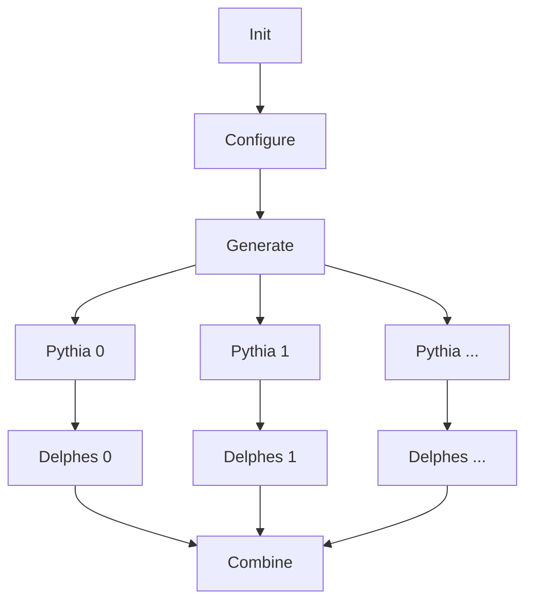

# Madminer workflow PH

[![CI/CD Status][ci-status-badge]][ci-status-link]
[![Docker pulls][docker-pulls-badge]][docker-pulls-link]
[![MIT license][mit-license-badge]][mit-license-link]
[![Code style][code-style-badge]][code-style-link]


## About
This repository defines a Physics workflow using the [Madminer package][madminer-repo]
as the base for generating events. To learn more about Madminer and its ML tools check
the [Madminer documentation][madminer-docs].

The workflow generates a file with _Pythia generated_ - _Delphes showered_ events as output.
This file can be later on used in the [Madminer ML workflow][madminer-workflow-ml],
which originally was a linked workflow after executing this one.


## Workflow definition
The workflow specification is composed of 3 hierarchical layers. From top to bottom:

1. **Workflow spec:** description of how steps are coordinated.
2. **Shell scripts:** entry points for each of the steps.
3. **Python scripts:** set of actions to interact with Madminer.

The division into multiple layers is very useful for debugging. It provides developers an easy way 
to test individual steps before testing the full workflow coordination.

Considering the workflow steps:




## Installation
For executing locally executing the steps of this workflow several non-trivial dependencies
need to be installed.

Follow the [installation guide][install-guide] to have your local environment ready.


### Formatting
All Python files are formatted using [Black][black-web]:

```shell
make check
```


## Execution
When executing the workflow (either fully or some of its parts) it is important to consider that
each individual step received inputs and generates outputs. Outputs are usually files, which need
to be temporarily stored to serve as input for later steps.

The _shell script layer_ provides an easy way to redirect outputs to what is called a `WORKDIR`.
The `WORKDIR` is just a folder where steps output files are stored to be used for other ones.
In addition, this layer provides a way of specifying the path where the project code and scripts 
are stored. This becomes useful to allow both _local_ and _within-docker_ executions.

When executing the workflow there are 2 alternatives:

### A) Individual steps
Individual steps can be launched using their shell script. Be aware their execution may depend on 
previous step outputs, so a sequential order must be followed.

Example:
```shell
scripts/1_configure.sh \
    --project_path . \
    --input_file workflow/input.yml \
    --output_dir .workdir
```

### B) Coordinated
The full workflow can be launched using [Yadage][yadage-repo]. Yadage is a YAML specification language
over a set of utilities that are used to coordinate workflows. Please consider that it can be hard
to define Yadage workflows as the [Yadage documentation][yadage-docs] is incomplete.
For learning about Yadage hidden features contact [Lukas Heinrich][lukas-profile], Yadage creator.

Yadage depends on having the Docker image used as environment already available on DockerHub. For pushing the
Docker image for this workflow, jump to the [Docker section](#docker).

Once the Docker image has been pushed:
```shell
pip3 install yadage
make yadage-run
```


## Docker
To build a new Docker image:
```shell
make build
```

To push a new Docker image, bump up the `VERSION` number and execute:

```shell
export DOCKERUSER=<your_dockerhub_username>
export DOCKERPASS=<your_dockerhub_password>
make push
```


[ci-status-badge]: https://github.com/madminer-tool/madminer-workflow-ph/actions/workflows/ci.yml/badge.svg?branch=main
[ci-status-link]: https://github.com/madminer-tool/madminer-workflow-ph/actions/workflows/ci.yml?query=branch%3Amain
[code-style-badge]: https://img.shields.io/badge/code%20style-black-000000.svg
[code-style-link]: https://github.com/psf/black
[docker-pulls-badge]: https://img.shields.io/docker/pulls/madminertool/madminer-workflow-ph.svg
[docker-pulls-link]: https://hub.docker.com/r/madminertool/madminer-workflow-ph
[mit-license-badge]: https://img.shields.io/badge/License-MIT-blue.svg
[mit-license-link]: https://github.com/madminer-tool/madminer-workflow-ph/blob/main/LICENSE

[black-web]: https://black.readthedocs.io/en/stable/
[install-guide]: docs/INSTALL.md
[madminer-docs]: https://madminer.readthedocs.io/en/latest/index.html
[madminer-repo]: https://github.com/madminer-tool/madminer
[madminer-workflow-ml]: https://github.com/madminer-tool/madminer-workflow-ml
[yadage-repo]: https://github.com/yadage/yadage
[yadage-docs]: https://yadage.readthedocs.io/en/latest/
[lukas-profile]: https://github.com/lukasheinrich
